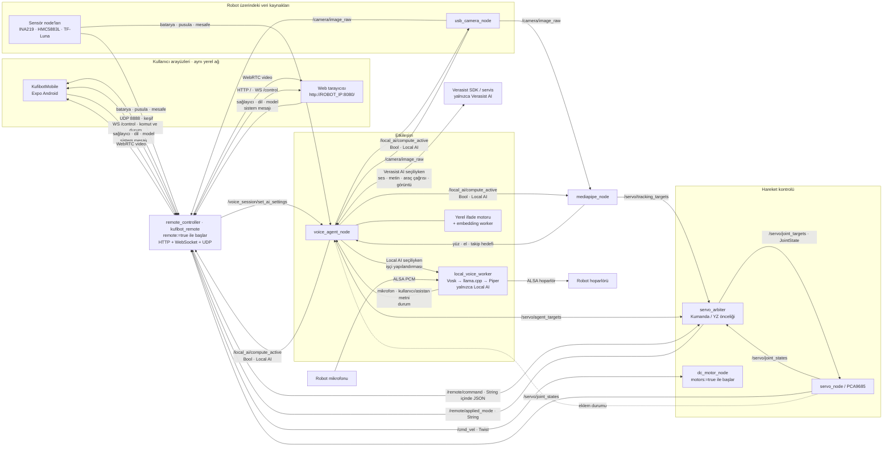
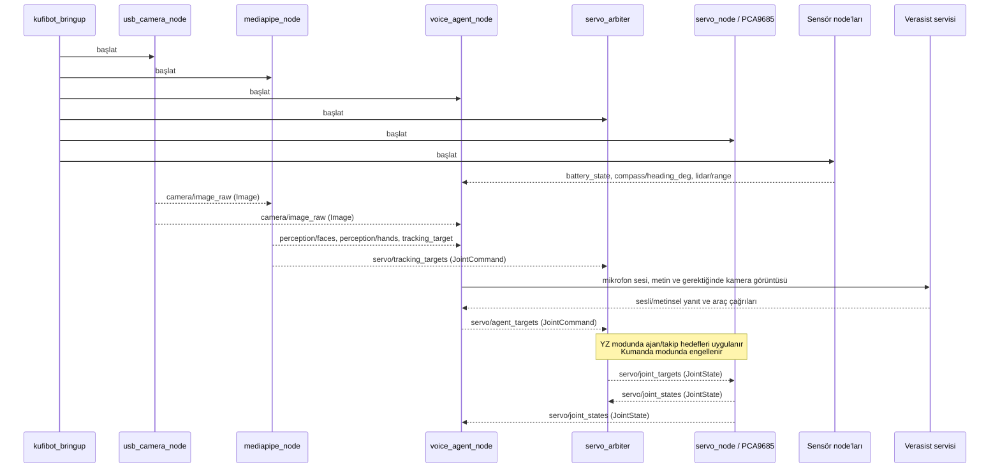
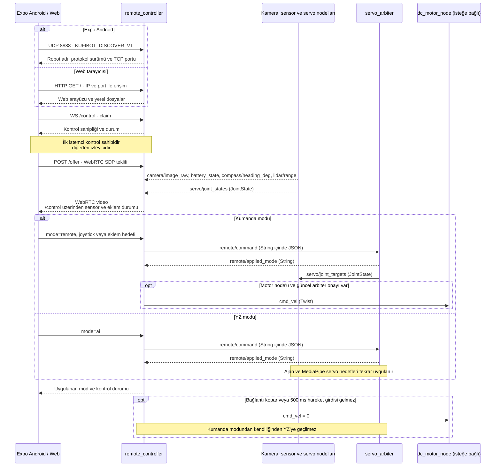

> **WSL üzerinde sesli Verasist simülasyonu:** [Kurulum ve kullanım](docs/simulation-ai.md)

# Kufibot ROS 2

ROS 2 Jazzy packages for Kufibot sensors, actuators, USB-camera perception,
MediaPipe tracking, Verasist veya yerelde çalışan sesli ajan ve Android/web
remote control.

Kufibot, Verasist.ai SDK'sı ile çalışan sesli yapay zekâ destekli bir ev
asistanı robotudur. Verasist üzerinden sosyal medya, CRM, yazılım ve çeşitli
servislerle entegrasyon kurulabilir; böylece robot farklı asistan görevlerini
yerine getirebilir ve platformlar arasında çalışabilir. Ayrıca Verasist'te
oluşturulan iş akışları, robotun belirli görevler için özelleştirilmesini sağlar.

Robot, React Native/Expo Android uygulaması veya tarayıcı üzerinden aynı yerel
ağda kontrol edilebilir. İki arayüz de canlı kamera, sensör göstergeleri,
hareket/kafa joystickleri, kol/göz kontrolleri ve Kumanda/YZ modu geçişini sunar.
Android uygulaması robotu UDP ile keşfeder; web kumandası doğrudan
`http://ROBOT_IP:8080/` adresinden açılır. İkisi de aynı ROS köprüsünü kullanır.

## Proje yapısı ve mimari

Sistem yedi ROS 2 paketinden ve iki kullanıcı arayüzünden oluşur.
`kufibot_bringup` paketleri bir araya getirir; çalışma zamanı paketleri bringup paketine bağımlı değildir.

| Paket | Sorumluluk |
| --- | --- |
| `kufibot_bringup` | Robotun tamamını veya takip zincirini başlatma; ortak YAML yapılandırması |
| `kufibot_interfaces` | Ortak mesaj sözleşmeleri: algılama, takip, eklem komutu, konuşma durumu ve metni |
| `kufibot_sensors` | INA219 batarya, HMC5883L pusula ve TF-Luna mesafe sürücüleri |
| `kufibot_perception` | USB kamera, MediaPipe algılama ve baş/boyun takip hedefleri |
| `kufibot_interaction` | Verasist oturumu veya yerel Vosk → llama.cpp → Piper ses zinciri, yerel ifade seçimi ve servo komut önceliklendirmesi |
| `kufibot_actuators` | PCA9685 servo çıkışı ve isteğe bağlı DC motor sürücüsü |
| `kufibot_remote` | Web arayüzünü sunma, UDP keşfi, WebSocket kamera/sensör aktarımı ve uzaktan kontrol köprüsü |

```text
ros2_kufibot/
├── README.md
├── requirements.txt             # Tüm platformların birleşik listesi (referans amaçlı)
├── requirements-common.txt      # Sim ve Pi arasında paylaşılan Python bağımlılıkları
├── requirements-sim.txt         # WSL/Ubuntu simülasyonuna özgü ek bağımlılıklar
├── requirements-pi.txt          # Raspberry Pi 5 donanımına özgü ek bağımlılıklar
├── pytest.ini                   # Kaynak testleri; donanım denemeleri hariç
├── KufibotMobile/                # React Native / Expo Android uygulaması
│   ├── App.tsx, src/             # Kamera, sensörler, joystickler ve bağlantı
│   └── modules/kufibot-discovery/ # Android için yerel UDP keşif modülü
├── KufibotController/            # Arayüze referans olan önceki Java uygulaması
├── tools/ros2_build_sim.sh       # WSL/Ubuntu simülasyon derlemesi
├── tools/ros2_build_pi.sh        # Raspberry Pi 5 donanım derlemesi
├── tools/ros2_launch.sh          # ROS + venv ortamını hazırlayan giriş noktası
├── src/
│   ├── kufibot_bringup/
│   │   ├── launch/              # interactive_robot ve tracking_test
│   │   └── config/interactive_robot.yaml
│   ├── kufibot_interfaces/msg/
│   ├── kufibot_sensors/
│   ├── kufibot_actuators/
│   ├── kufibot_perception/
│   ├── kufibot_interaction/
│   │   ├── kufibot_interaction/ # Python modülleri
│   │   └── test/                # Otomatik testler
│   └── kufibot_remote/
│       ├── kufibot_remote/     # ROS adaptörü, kontrol mantığı ve ağ sunucusu
│       │   └── web/            # HTML/CSS/JS web kumandası; ROS paketiyle kurulur
│       └── test/               # Köprü, HTTP/WebSocket ve Chromium testleri
└── build/, install/, log/       # Colcon üretir; kaynak değildir
```

Python paketlerinde `package.xml`, `setup.py`, `setup.cfg` ve `resource/`
paketleme metaverisidir. Sensör ve aktüatörlerin elle çalıştırılan donanım
denemeleri ilgili paketin `test/manual/` dizinindedir. Mevcut iç içe derleme
çıktıları silinmedi; keşif dışında tutulur. Yeni derlemeleri yalnızca çalışma
alanının kökünden `--base-paths src` ile yapın.

Aşağıdaki şema çalışma zamanı veri akışını gösterir. Topic adları varsayılan,
isim alanı kullanılmayan başlatmaya aittir.



Kamera ve sensör verileri hem ses ajanına hem uzaktan kontrol köprüsüne gider;
köprü mevcut ROS kamera görüntüsünü WebRTC ile yayınlar, kamera aygıtını ikinci kez
açmaz. Web arayüzü köprünün içinden sunulur; robot üzerinde ayrı Node.js sunucusu
gerekmez. HTTP, `/control` ve `/offer` varsayılan TCP `8080` portunu paylaşır;
video WebRTC'nin ICE ile belirlediği UDP portlarını kullanır.
UDP `8888` yalnızca Android keşfi içindir.

Sesli Ajan Ayarları'nda seçilen sağlayıcı, dil, modeller ve yalnızca Local AI için
sistem mesajı köprüden `voice_agent_node`'a gider. YZ modu seçildiğinde node,
seçime göre Verasist oturumunu veya ayrı `local_voice_worker` sürecini başlatır.
Yerel işçinin LLM çıkarımı olayıyla `voice_agent_node`
`local_ai/compute_active` yayınlar; kamera, MediaPipe ve köprünün canlı görüntü
kodlaması geçici olarak durur. Bu sinyal Verasist akışında yayınlanmaz.

Arbiter varsayılan olarak Kumanda modunda başlar. Köprü başlatıldığında ajan ve
takip servo komutları engellenir, uzaktan gelen
eklem hedefleri uygulanır. YZ modunda süreli ajan komutları takip komutlarına
önceliklidir. Takip yalnızca `neck` ve `headLeftRight` eklemlerini hedefler;
arbiter eklem sınırlarını uygular. Servo sürücüsünün elle deneme için kabul ettiği
`/servo/<joint>/angle_deg` girişleri arbiter dışındadır.

`interactive_robot.launch.py`, `remote:=true` ile köprüyü, `motors:=true` ile DC
motor node'unu başlatır; ikisi de varsayılan olarak açıktır. Bu nedenle
argümansız `./tools/ros2_launch.sh` doğrudan Kumanda modunda açılır. Tanılama
veya donanımsız çalıştırma için `remote:=false` ya da `motors:=false` verilebilir.
Ses ajanı `/cmd_vel` üretmez. `tracking_test.launch.py` bu iki node'u başlatmaz.

### Servo eksen testi

`servo_node` açılışta sağ kolu 15°, sol kolu 170°, boynu 10°, başı 90°,
sağ gözü 170° ve sol gözü 0° konumuna sırayla komutlar; açıları yapılandırılmış
eklem sınırlarıyla kısıtlar. Her servo için `startup_settle_sec` (varsayılan
1,5 saniye) bekler. Yaklaşık 9 saniyelik bu başlangıç boyunca gelen servo
komutları atılır ve eklem durumu yayınlanmaz. I²C yazımı başarısız olursa aynı
servo yeniden denenir; normal komutlara geçilmez. Simülasyon aynı akışı kullanır.
Konum geri bildirimi yoktur: ilk hareket doğrudan varsayılan açıya komutlanır,
hızı ve fiziksel varış doğrulanamaz. Adımlı hız sınırlaması başlangıçtan sonraki
hareketlerde uygulanır.

PCA9685 servo sürücüsünü ve güvenli, sıralı eksen testini tek komutla başlatmak
için çalışma alanı kökünden şunu çalıştırın:

```bash
./tools/servo_axis_test.sh
```

Betik önce `servo_node` düğümünü başlatır; ardından her eklemi tek tek test
pozlarına götürüp varsayılan konumuna döndürür. Test tamamlandığında ya da
`Ctrl+C` ile kesildiğinde başlattığı servo düğümünü kapatır. Bekleme süresini
değiştirmek için ROS parametresi geçirilebilir:

```bash
./tools/servo_axis_test.sh --ros-args -p hold_seconds:=3.0
```

## Robotun çalışma akışı

`interactive_robot.launch.py` çalıştığında sensör, kamera, MediaPipe, servo,
arbiter ve ses ajanı node'ları birlikte başlar. İsteğe bağlı uzaktan kontrol ve
motor node'ları yukarıdaki launch argümanlarıyla eklenir. Varsayılan
yapılandırmada ses ajanı Kumanda modunda bekler; web veya mobil arayüzden YZ
modu onaylanınca Verasist oturumunu otomatik açar. Kumanda moduna dönülünce
oturumu ve otomatik YZ davranışlarını durdurur. `auto_start` yalnızca
`remote_mode_controls_voice: false` yapılandırması için başlangıç oturumunu açar;
bu özel yapılandırmada oturum aşağıdaki servisle de başlatılabilir:

```bash
ros2 service call /voice_session/start std_srvs/srv/Trigger '{}'
```

YZ tarafındaki başlatma ve veri akışı aşağıdadır; launch node'ları başlatır,
ok sırası aralarında bir hazır olma garantisi ifade etmez. Okların üzerindeki
adlar ROS topic veya servistir; parantez içi ifadeler mesaj türünü gösterir.
Uzaktan kumanda akışı sonraki şemada ayrıca gösterilir.



Konuşma turunda ses ajanı, sensör ve algılama verilerini kısa süreli önbellekte
tutar. Kullanıcı konuşmaya başladığında güncel kamera görüntüsünü oturuma
bağlamaya çalışır. Servisten gelen araç çağrısı eklem hareketi istiyorsa ajan
`/servo/agent_targets` yayınlar. Aynı anda MediaPipe takip hedefi yayınlasa
bile arbiter, YZ modunda ajan komutunu yalnızca belirlenen bekleme süresi boyunca
öncelikli tutar; süre dolunca takip kontrolü devam eder. Kumanda modunda sesli
asistan oturumu sürer ancak bu ajan/takip servo komutları uygulanmaz.

Ses ajanının dışarıya yayımladığı durum ve metin topic'leri, bir arayüz veya
kayıt node'u eklemek için kullanılabilir:

| Topic / servis | Tür | Yön | Amaç |
| --- | --- | --- | --- |
| `/voice_session/state` | `kufibot_interfaces/VoiceState` | ses ajanı → tüketiciler | Oturumun anlık durumu |
| `/voice_session/transcript` | `kufibot_interfaces/Transcript` | ses ajanı → tüketiciler | Kullanıcı ve asistan metinleri |
| `/voice_session/start` | `std_srvs/Trigger` | istemci → ses ajanı | Canlı oturumu başlatır |
| `/voice_session/stop` | `std_srvs/Trigger` | istemci → ses ajanı | Canlı oturumu durdurur |

Sadece takip zincirini doğrulamak için `tracking_test.launch.py` kamera,
MediaPipe, arbiter ve isteğe bağlı servo node'unu başlatır. Batarya, pusula,
mesafe ve ses ajanı bu modda çalışmaz.

`expression_engine.py`, `expression_embedding.py`, `tracking.py` ve
`tracking_controller.py` algoritmaları ROS node adaptörlerinden ayrıdır.
Yeni davranışları bu ayrımı koruyarak ekleyin; paketler arası veri alışverişi
ROS mesajları üzerinden yapılmalıdır. Ortak mesajlar `kufibot_interfaces`
içinde, sisteme özgü başlatma tercihleri `kufibot_bringup` içinde tutulur.

## Mobil ve web uzaktan kumanda

Her iki arayüz önceki Java `KufibotController` uygulamasının kamera üstüne
bindirilmiş kumanda düzenini temel alır. Üst köşelerde akım, gerilim, pusula ve
mesafe; solda hareket, sağda kafa joysticki; altta kol sürgüleri ve göz anahtarları
bulunur. Üst ortadan **KUMANDA / YZ MODU** seçilir.

| Arayüz | Kaynak | Bağlantı ve kullanım |
| --- | --- | --- |
| Expo Android | `KufibotMobile/` | Aynı ağda UDP keşfi; robot seçimi veya elle IP girişi; development build / APK |
| Web | `src/kufibot_remote/kufibot_remote/web/` | `http://ROBOT_IP:8080/`; fare ve dokunmatik joystickler, WASD ve yön tuşlarıyla hareket, dokunmatik/fare ile kafa |

### Başlatma ve erişim

Ana kurulum adımlarından sonra, proje kökünde:

```bash
./tools/ros2_launch.sh kufibot_bringup interactive_robot.launch.py \
  remote:=true motors:=true
```

Yalnızca kamera, sensörler ve servo kontrolü için `motors:=false` kullanın.
Robot yığını zaten çalışıyorsa ikinci kez başlatmayın; mevcut köprü güncellemeden
sonra yeniden başlatılmalıdır. Yığına yalnızca köprü ekleme adımları
[web kumandası rehberinde](src/kufibot_remote/README.md) bulunur.

Web için tarayıcıda `http://ROBOT_IP:8080/` açılır; robot IP'si robot üzerinde
`hostname -I` ile görülebilir. Sayfa kamera ve kontrol soketlerini kendi IP/port
adresinden açar; tarayıcıda UDP keşfi gerekmez. Robot üzerinde npm, Expo veya
ayrı bir web sunucusu çalıştırılmaz.

Android uygulamasını Node.js ve Android SDK bulunan geliştirme bilgisayarında
kurmak için:

```bash
cd KufibotMobile
npm ci
npm run android
```

Yerel UDP keşif modülü nedeniyle Expo Go yerine development build kullanılır.
APK derleme, bağlantı ve telefon kurulumu ayrıntıları
[mobil kumanda rehberindedir](KufibotMobile/README.md).

`src/kufibot_bringup/config/interactive_robot.yaml` içindeki `remote_controller`
parametreleri `robot_name`, `port` (varsayılan `8080`) ve `discovery_port`
(varsayılan `8888`) değerlerini belirler. Keşif portu Android modülündeki portla
aynı kalmalıdır. İstemci ve robot güvenilen aynı yerel ağda olmalıdır; bu sürüm
internet erişimi, TLS veya parola/eşleştirme sağlamaz.

### Keşif, görüntü ve kontrol akışı



| Topic / uç | Tür | Yön ve amaç |
| --- | --- | --- |
| `/remote/command` | `std_msgs/String` içinde JSON | Köprü → arbiter; mod ve derece cinsinden eklem hedefleri |
| `/remote/applied_mode` | `std_msgs/String` | Arbiter → köprü; uygulanan mod veya `unavailable` |
| `/cmd_vel` | `geometry_msgs/Twist` | Köprü → DC motor; sürüş ve durma komutları |
| `/control` | WebSocket JSON | İstemci ↔ köprü; sahiplik, heartbeat, mod, girişler ve sensör/eklem durumu |
| `/offer` | HTTP SDP signaling | WebRTC video; varsayılan 480 piksel genişlik ve 15 FPS hedefi |

Bir telefon veya tarayıcı kontrol sahibiyken diğer istemciler izleyici olur.
Kontrol sahibi ayrılınca **Kumandayı devral** ile kontrol alınabilir. Uygulama veya
sekme arka plana geçtiğinde kontrol bağlantısı bırakılır; tekrar bağlanırken
önceki joystick/tuş girdileri yürütülmez. Hareket komutunun 500 ms kesilmesi
joystick girdilerini sıfırlar; iki saniye heartbeat kesintisi sahipliği bırakır.
Köprü çökerse motor node'unun bağımsız watchdog'u durdurur; arbiter Kumanda
modunda son servo hedefini tutar.

Arbiter mod onayı yoksa joystickler etkinleşmez. Motor abonesi yoksa hareket
joysticki pasiftir. Üç saniyeden eski sensörler `—`, iki saniyedir yenilenmeyen
kamera bekleme ekranı olarak gösterilir. **DUR / Boşluk** kumanda joysticklerini
sıfırlar; YZ servo hareketlerini iptal eden fiziksel acil durdurma değildir.
Telefon mikrofonundan ses aktarımı ve otonom navigasyon bu arayüzlerin parçası
değildir; sesli asistan robotun mikrofonunda çalışır.

## Mimik donanım testi

Arbiter ve servo node çalışırken, tüm tanımlı mimikleri sırayla denemek için
arayüzden YZ modunu seçin. Kumanda modu bu ajan komutlarını engeller;
köprüyü kapatmak YZ moduna geçirmez:

```bash
ros2 run kufibot_interaction expression_test_node
```

Her mimik bittikten sonra robot varsayılan dinlenme pozuna döner ve bir saniye
bekler. Tekrar döngüsü veya belirli mimikler için parametre verilebilir:

```bash
ros2 run kufibot_interaction expression_test_node --ros-args \
  -p repeat:=true -p pause_sec:=2.0 -p motions:="[greeting,happy,thinking]"
```

`Ctrl+C` ile durdurmak da robotu dinlenme pozuna gönderir.

**Taşıma notu:** `interactive_robot.launch.py`, `tracking_test.launch.py` ve
`interactive_robot.yaml`, `kufibot_interaction` paketinden `kufibot_bringup`
paketine taşındı. Yeniden derleyin ve aşağıdaki yeni launch komutlarını kullanın.
Varsayılan `./tools/ros2_launch.sh` komutu yeni paketi kullanır.

YAML içindeki model ve hareket dosyaları ile `requirements.txt` içindeki özel
SDK yolu hâlâ bu robota özgüdür; başka makinede bunları uyarlayın.
`VERASIST_ENV_FILE`, `VERASIST_SDK_SRC` ve `ROS_SETUP` ortam değişkenleri
başlatma betiğinin ilgili yollarını değiştirebilir. Paylaşılan YAML içine token
koymayın. Mevcut YAML'de `auto_start: false` ve
`remote_mode_controls_voice: true` olduğundan ses oturumu yalnızca YZ modu
onaylandığında başlar. Bağımsız ses ajanı davranışı istenirse
`remote_mode_controls_voice: false` ve gerekirse `auto_start: true` ayarlanır.

## Geliştirme doğrulaması

Çalışma alanının kökünde, derlemeden sonra:

```bash
source /opt/ros/jazzy/setup.bash
source install/setup.bash
source .venv/bin/activate
PYTEST_DISABLE_PLUGIN_AUTOLOAD=1 python -m pytest -q
```

Bu komut etkileşim, algılama ve uzaktan kontrolün donanım gerektirmeyen testlerini
çalıştırır. HTTP/WebSocket testleri localhost soketi açar. Playwright ve sistem
Chromium kuruluysa web arayüzünün kamera, fare/klavye/çift dokunma, sahiplik ve
bağlantı testleri de çalışır; bunlar yoksa tarayıcı testi atlanır. Tarayıcı testi
gerçek robot yerine test görüntüsü ve sensör değerleri kullanır.

Mobil uygulamanın TypeScript kontrolü, `KufibotMobile/` dizininde
`npm run typecheck` ile yapılır. Pytest eklentilerinin otomatik yüklemesi,
ortamda kurulu ROS `launch_testing` eklentisinin pytest sürümüyle
uyumsuz olabilmesi nedeniyle kapatılır. Paketlerin lint kontrolleri ayrıca
`colcon test` ile çalıştırılabilir. `test/manual/` betikleri ROS ortamı ve
ilgili sürücü node'ları hazırken elle çalıştırılır; aktüatör denemeleri fiziksel
hareket üretir ve otomatik test keşfine alınmaz.

## Install

There are two supported build targets, each with its own Python dependency set:

- **Simulation (WSL/Ubuntu, no hardware):** `./tools/ros2_build_sim.sh` installs
  `requirements-sim.txt` (shared dependencies plus Panda3D/pygame) and runs
  `colcon build`.
- **Raspberry Pi 5 (real robot):** `./tools/ros2_build_pi.sh` installs
  `requirements-pi.txt` (shared dependencies plus the sensor/actuator drivers
  and MediaPipe/OpenCV perception stack) and runs `colcon build`.

Both scripts create `.venv` with `--system-site-packages` on first run so
apt-installed ROS 2 Python modules (`rclpy`, `cv_bridge`, generated messages)
remain visible, and export `PYTHONPATH` where needed. To reproduce the steps
manually instead:

```bash
source /opt/ros/jazzy/setup.bash
rosdep install --from-paths src --ignore-src -r -y
python3 -m venv --system-site-packages .venv
source .venv/bin/activate
python -m pip install --upgrade pip
python -m pip install -r requirements-sim.txt   # or requirements-pi.txt on the robot

# ROS-generated executables use the system interpreter. Make packages installed
# in this venv visible to those executables as well.
export PYTHONPATH="$(python -c 'import sysconfig; print(sysconfig.get_path("purelib"))'):${PYTHONPATH:-}"

colcon build --base-paths src --symlink-install
source install/setup.bash
```

Python dependency ownership:

- All third-party Python packages used by sensors, actuators, perception,
  voice interaction, and the remote-control bridge are split across
  `requirements-common.txt`, `requirements-sim.txt` and `requirements-pi.txt`.
  The root `requirements.txt` combines both platform files for reference and
  manual full installs.
- ROS Python modules such as `rclpy` and generated message modules
  remain apt/rosdep dependencies and become visible in the virtual environment
  through `--system-site-packages`.
- `kufibot_sensors` and `kufibot_actuators` themselves are ROS packages; they
  are installed into `install/` by `colcon build`, not by pip.

The robot voice profile uses PipeWire WebRTC echo cancellation with a Bluetooth
reference delay, followed by adaptive SpeexDSP noise reduction. Install the
system library with `sudo apt install libspeexdsp1`; this is not a pip dependency.
See [audio setup and measured results](docs/voice-duplex-camera.md).
`webrtc-audio-processing` is intentionally not installed: release 0.1.3 tries
to compile x86 SSE sources on aarch64 and is not imported by the runtime.

If the local SDK checkout is not present, copy it from the Verasist server and
then install the copied source. Run these commands from the repository root:

```bash
mkdir -p vendor
scp -r root@88.99.219.93:/root/verasist/sdk ./vendor/verasist-sdk

# Change the editable SDK path in requirements-common.txt to:
# -e ./vendor/verasist-sdk[voice]
python -m pip install -r requirements-pi.txt   # or requirements-sim.txt
```

Verify the SDK installation before starting ROS:

```bash
python -c "from verasist_sdk import LiveSession, VerasistClient; print('Verasist SDK OK')"
```

The API token is intentionally never stored in the repository:

```bash
export VERASIST_API_TOKEN='...'
ros2 launch kufibot_bringup interactive_robot.launch.py
ros2 service call /voice_session/start std_srvs/srv/Trigger '{}'
```

Activate `.venv` and export the same `PYTHONPATH` in every new terminal before
launching perception or voice nodes. Do not use pip's
`--break-system-packages`; it can damage the ROS/Debian Python installation.

Use `config:=/absolute/path/to/config.yaml` to override the camera, ALSA,
tracking, endpoint, or trigger settings. Stop the cloud session with
`/voice_session/stop`. The Verasist gateway does not publish `cmd_vel` and
cannot control the drive motors.

By default, the voice agent attaches a fresh camera snapshot when the first
interim transcript of each spoken user turn arrives
(`camera_attach_to_every_user_turn: true`). This is the earliest speech-start
signal exposed by the SDK. The upload is scheduled asynchronously while the
user is still speaking, so the image is normally in context before the final
transcript triggers the LLM response. Verasist's current protocol
sends this as a `device-image` event in the same live conversation; it is not
physically embedded in the WebRTC audio packet. Automatic uploads use
`trigger_response=false`: they enrich subsequent conversation context without
starting a second, competing LLM response. If a provider emits only a final
transcript, the node performs a fallback upload, but that late frame may only
affect the following turn. The local cooldown follows the backend's two-second
per-run image rate limit. Set the parameter to `false` for tool-only capture.

The voice agent can also send an on-demand camera snapshot to Verasist's
multimodal LLM. Ask, for example, "Kameraya bakıp ne gördüğünü anlat" or
"Elimdeki nesne nedir?". The agent invokes `analyze_camera`, encodes the most
recent `/camera/image_raw` frame as a bounded JPEG, and sends it through the
SDK with `trigger_response=true`. This explicit tool path is the correct way to
request a new visual response when the speech-start snapshot is unavailable or
the user explicitly asks the robot to look again.
Successful delivery is logged as:

```text
Agent tool: analyze_camera prompt=...
Camera image accepted by Verasist (... bytes)
```

Snapshot freshness, width, JPEG quality, and cooldown are configurable under
`voice_agent_node` in `src/kufibot_bringup/config/interactive_robot.yaml`.

MediaPipe is isolated in its own node: if it is not installed or the camera
is unavailable those nodes fail with an explicit error, while sensors,
actuators, arbitration, and voice nodes remain independent processes.

## Face and hand tracking test

The complete tracking chain can be started from one launch file. It starts the
USB camera, MediaPipe, servo arbiter, and PCA9685 servo node; it does not start
the DC motors, other sensors, or Verasist:

```bash
./tools/ros2_launch.sh kufibot_bringup tracking_test.launch.py
```

This wrapper activates `.venv`, adds its packages to `PYTHONPATH`, and sources
ROS 2 Jazzy plus `install/setup.bash` automatically. With no arguments it
starts the complete interactive robot:

```bash
./tools/ros2_launch.sh
```

For a command-only test without physical servo movement:

```bash
./tools/ros2_launch.sh kufibot_bringup tracking_test.launch.py \
  enable_servo:=false
```

Override the camera or enable annotated images when needed:

```bash
./tools/ros2_launch.sh kufibot_bringup tracking_test.launch.py \
  camera_device:=/dev/video0 debug_image:=true
```

## Background expressions

Expression commands reach the servos only in AI mode. Remote-control mode blocks
these commands at the arbiter while the voice session continues.

Facial expressions are selected locally, without an LLM tool call. Assistant
speech is detected from the received audio stream: when playback starts, the
configured `talking` motion begins immediately and repeats for as long as the
robot is speaking. It returns to the configured idle pose when playback stops.
This path does not wait for an assistant transcript, so it remains synchronized
even when the SDK sends final text late. A final assistant transcript that
arrives before speech begins may still select an emotional/reactional motion
with `llama-cpp-python` embeddings; speech playback takes priority over it.

`interactive_robot.yaml` exposes `expression_model_path` (default
`/usr/local/ai.models/llamaModel/mxbaiV1.gguf`), `expression_n_threads` (2),
`expression_n_ctx` (512), and `expression_n_gpu_layers` (0, CPU). Mean pooling
matches the C++ reference configuration. Batch and microbatch equal the context
size; long inputs are truncated to fit. Catalogue embeddings are cached in RAM.
Install the root requirements into the same Python environment used by ROS.
On platforms without a wheel, llama-cpp-python requires a C/C++ build toolchain
and CMake to compile its bundled llama.cpp.

A single background worker owns the model. Only the current turn can enqueue
a motion; interrupted turns and closed sessions discard late results. Missing
models, startup warm-up, and inference errors use the local keyword classifier
without delaying speech or playing a second expression later. Selection logs
include the motion, similarity (`None` for fallback), and inference time.
The catalogue descriptions remain English; inspect Turkish response selections
on the target robot before tuning the descriptions or CPU thread count.

Target-machine smoke test (llama-cpp-python 0.3.35, CPU, two threads): model
loading plus catalogue preparation took 4.72 s; six short Turkish inputs took
75–199 ms each. A long input truncated to the 512-token context took 5.46 s.
These are standalone measurements, not concurrent audio latency guarantees.
English greeting/happiness examples matched the expected motions. Turkish
quality was mixed: “Merhaba, hoş geldin!” selected `happy`, and an expression
of concern selected `curious`. The requested model, English catalogue and mean
pooling are preserved. The model metadata defaults to CLS pooling; overriding
it with mean pooling intentionally matches the C++ configuration and emits a
llama.cpp notice on startup.

Yerel Vosk / llama.cpp / Piper sesli ajanı ve web-mobil sağlayıcı/model seçimi:
[Local AI kurulumu ve kullanımı](docs/local-ai.md).


### 3B robot simülasyonu

LLM yerine araçları kendiniz çağırabileceğiniz görsel navigasyon paneli:

```bash
./tools/navigation_sim_demo.sh
# eşdeğer kısa ad:
./tools/navigation_sim.sh
```

Araç seçip parametrelerini girin ve Çağır düğmesine basın. `read_sensor_values`
temiz kamera görüntüsü ve sayısal harita verir; `follow_route` tüm waypoint’leri tek çağrıda otomatik takip eder. Rota web/mobil haritasında gösterilir. `goto` ve `look_at` düşük seviyeli tanılama için korunur. Ayrıntılar: [Waypoint navigasyonu](docs/waypoint-navigation.md).
Ev planı, robotun yolu, canlı kamera, teslim edilen fotoğraflar ve tam JSON
sonuçları aynı pencerede görünür. Yanıtınızı da yazıp kaydedebilirsiniz.
Başlangıçta otomatik çağrı yapılmaz; hazır mutfak rotası için `--auto` ekleyin.
Esc ile durdurulur.
[Demo ve test ayrıntıları](docs/navigation-simulation-tests.md).

`tools/ros2_sim_launch.sh sim` donanımsız ROS simülasyonunu ve Panda3D
üçüncü şahıs penceresini açar. Görüntüleyici için proje sanal ortamında
`pip install 'panda3d>=1.10.15,<1.11'` ve grafik masaüstü gerekir.
Plan editörü pygame kullanmaya devam eder.

Robotu `http://BILGISAYAR_IP:8080/` üzerinden veya mevcut mobil uygulamayla
kontrol edin. Webde W/yukarı ileri, S/aşağı geri, A/sol ve D/sağ dönüş;
eşzamanlı eksenlerde dönüş önceliklidir. Baş/kol/gözler ekrandaki kontrollerden
hareket ettirilir. 3B pencere motor komutu göndermez.

3B pencereye tıklayın ve fareyi hareket ettirerek robotun çevresine bakın.
Fare tekerleği mesafeyi değiştirir, R kamerayı arkaya alır, M üstten görünümü
açar. Esc veya odak kaybı fareyi serbest bırakır. Pencereyi kapatmak başlatılan
simülasyonu da kapatır. Veri kesildiğinde tekerlek animasyonu durur.

Ev geometrisi mevcut floorplan JSON dosyasından üretilir; kapılar açık geçittir.
Robot basit eklemli bir modeldir; düz zeminde gövde çarpışması uygulanır.
Web/mobil robot kamera yayını ayrı, mevcut birinci şahıs sensör görüntüsüdür.

Tekerlek açıklığı motor ve dünya için ortak ayarlanır:
`tools/ros2_sim_launch.sh sim wheel_separation_m:=0.2`.

### 3D mimik editörü

Web ve mobil sol üst menüsündeki **Mimikler** sayfasında STL tabanlı robot
üzerinden zamanlı servo pozları oluşturabilir, kaydedebilir ve bağlı robotta
veya simülasyonda çalıştırabilirsiniz. [Kullanım, model kalibrasyonu ve API](docs/mimics.md).
