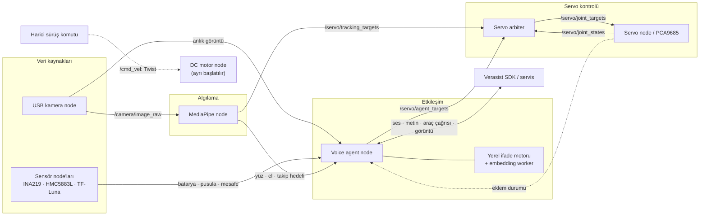
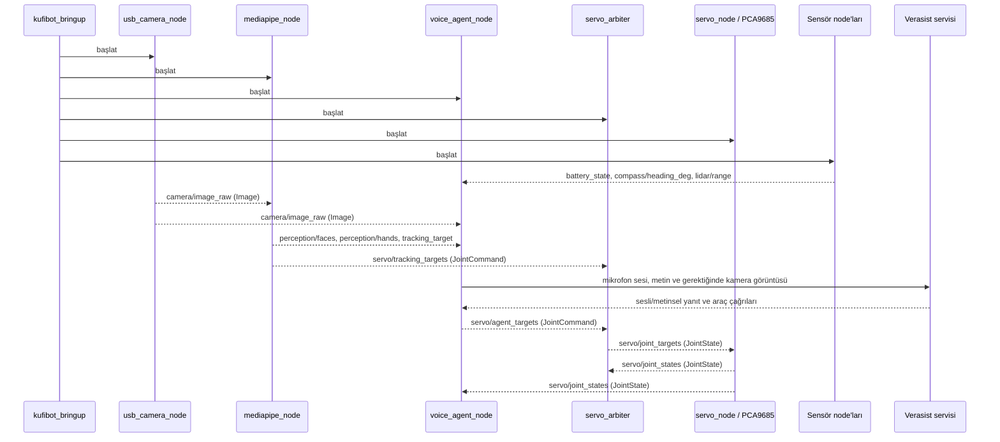

# Kufibot ROS 2

ROS 2 Jazzy packages for Kufibot sensors, actuators, USB-camera perception,
MediaPipe tracking, and a Verasist live voice agent.

Kufibot, Verasist.ai SDK'sı ile çalışan sesli yapay zekâ destekli bir ev
asistanı robotudur. Verasist üzerinden sosyal medya, CRM, yazılım ve çeşitli
servislerle entegrasyon kurulabilir; böylece robot farklı asistan görevlerini
yerine getirebilir ve platformlar arasında çalışabilir. Ayrıca Verasist'te
oluşturulan iş akışları, robotun belirli görevler için özelleştirilmesini sağlar.

## Proje yapısı ve mimari

Sistem altı ROS 2 paketinden oluşur. `kufibot_bringup` paketleri bir araya
getirir; çalışma zamanı paketleri bringup paketine bağımlı değildir.

| Paket | Sorumluluk |
| --- | --- |
| `kufibot_bringup` | Robotun tamamını veya takip zincirini başlatma; ortak YAML yapılandırması |
| `kufibot_interfaces` | Ortak mesaj sözleşmeleri: algılama, takip, eklem komutu, konuşma durumu ve metni |
| `kufibot_sensors` | INA219 batarya, HMC5883L pusula ve TF-Luna mesafe sürücüleri |
| `kufibot_perception` | USB kamera, MediaPipe algılama ve baş/boyun takip hedefleri |
| `kufibot_interaction` | Verasist oturumu, ses, yerel ifade seçimi ve servo komut önceliklendirmesi |
| `kufibot_actuators` | PCA9685 servo çıkışı ve ayrı çalıştırılan DC motor sürücüsü |

```text
ros2_kufibot/
├── README.md
├── requirements.txt             # ROS dışı Python bağımlılıkları
├── pytest.ini                   # Kaynak testleri; donanım denemeleri hariç
├── tools/ros2_launch.sh          # ROS + venv ortamını hazırlayan giriş noktası
├── src/
│   ├── kufibot_bringup/
│   │   ├── launch/              # interactive_robot ve tracking_test
│   │   └── config/interactive_robot.yaml
│   ├── kufibot_interfaces/msg/
│   ├── kufibot_sensors/
│   ├── kufibot_actuators/
│   ├── kufibot_perception/
│   └── kufibot_interaction/
│       ├── kufibot_interaction/ # Python modülleri
│       └── test/                # Otomatik testler
└── build/, install/, log/       # Colcon üretir; kaynak değildir
```

Python paketlerinde `package.xml`, `setup.py`, `setup.cfg` ve `resource/`
paketleme metaverisidir. Sensör ve aktüatörlerin elle çalıştırılan donanım
denemeleri ilgili paketin `test/manual/` dizinindedir. Mevcut iç içe derleme
çıktıları silinmedi; keşif dışında tutulur. Yeni derlemeleri yalnızca çalışma
alanının kökünden `--base-paths src` ile yapın.

Aşağıdaki şema çalışma zamanı veri akışını gösterir. Topic adları varsayılan,
isim alanı kullanılmayan başlatmaya aittir.



Arbiter, süreli ajan komutlarına takip komutları karşısında öncelik verir ve
eklem sınırlarını uygular. Takip yalnızca `neck` ve `headLeftRight` eklemlerini
hedefler. Servo sürücüsü ayrıca elle deneme için `/servo/<joint>/angle_deg`
girişlerini kabul eder; bu yol arbiter dışındadır. DC motor node, iki bringup
launch dosyasında da başlatılmaz ve ses ajanı `/cmd_vel` üretmez.

## Robotun çalışma akışı

`interactive_robot.launch.py` çalıştığında sensör, kamera, MediaPipe, servo,
arbiter ve ses ajanı node'ları birlikte başlar. Ses ajanındaki `auto_start`
parametresi açıksa Verasist oturumunu da açar; kapalıysa oturum aşağıdaki
servisle başlatılır:

```bash
ros2 service call /voice_session/start std_srvs/srv/Trigger '{}'
```

Node'ların çalışma sırası ve birbirleriyle haberleşmesi aşağıdadır. Okların
üzerindeki adlar ROS topic veya servistir; parantez içi ifadeler mesaj türünü
gösterir.



Konuşma turunda ses ajanı, sensör ve algılama verilerini kısa süreli önbellekte
tutar. Kullanıcı konuşmaya başladığında güncel kamera görüntüsünü oturuma
bağlamaya çalışır. Servisten gelen araç çağrısı eklem hareketi istiyorsa ajan
`/servo/agent_targets` yayınlar. Aynı anda MediaPipe takip hedefi yayınlasa
bile arbiter ajan komutunu yalnızca belirlenen bekleme süresi boyunca öncelikli
tutar; süre dolunca takip kontrolü devam eder.

Ses ajanının dışarıya yayımladığı durum ve metin topic'leri, bir arayüz veya
kayıt node'u eklemek için kullanılabilir:

| Topic / servis | Tür | Yön | Amaç |
| --- | --- | --- | --- |
| `/voice_session/state` | `kufibot_interfaces/VoiceState` | ses ajanı → tüketiciler | Oturumun anlık durumu |
| `/voice_session/transcript` | `kufibot_interfaces/Transcript` | ses ajanı → tüketiciler | Kullanıcı ve asistan metinleri |
| `/voice_session/start` | `std_srvs/Trigger` | istemci → ses ajanı | Canlı oturumu başlatır |
| `/voice_session/stop` | `std_srvs/Trigger` | istemci → ses ajanı | Canlı oturumu durdurur |

Sadece takip zincirini doğrulamak için `tracking_test.launch.py` kamera,
MediaPipe, arbiter ve isteğe bağlı servo node'unu başlatır. Batarya, pusula,
mesafe ve ses ajanı bu modda çalışmaz.

`expression_engine.py`, `expression_embedding.py`, `tracking.py` ve
`tracking_controller.py` algoritmaları ROS node adaptörlerinden ayrıdır.
Yeni davranışları bu ayrımı koruyarak ekleyin; paketler arası veri alışverişi
ROS mesajları üzerinden yapılmalıdır. Ortak mesajlar `kufibot_interfaces`
içinde, sisteme özgü başlatma tercihleri `kufibot_bringup` içinde tutulur.

## Mimik donanım testi

Arbiter ve servo node çalışırken, tüm tanımlı mimikleri sırayla denemek için:

```bash
ros2 run kufibot_interaction expression_test_node
```

Her mimik bittikten sonra robot varsayılan dinlenme pozuna döner ve bir saniye
bekler. Tekrar döngüsü veya belirli mimikler için parametre verilebilir:

```bash
ros2 run kufibot_interaction expression_test_node --ros-args \
  -p repeat:=true -p pause_sec:=2.0 -p motions:="[greeting,happy,thinking]"
```

`Ctrl+C` ile durdurmak da robotu dinlenme pozuna gönderir.

**Taşıma notu:** `interactive_robot.launch.py`, `tracking_test.launch.py` ve
`interactive_robot.yaml`, `kufibot_interaction` paketinden `kufibot_bringup`
paketine taşındı. Yeniden derleyin ve aşağıdaki yeni launch komutlarını kullanın.
Varsayılan `./tools/ros2_launch.sh` komutu yeni paketi kullanır.

YAML içindeki model ve hareket dosyaları ile `requirements.txt` içindeki özel
SDK yolu hâlâ bu robota özgüdür; başka makinede bunları uyarlayın.
`VERASIST_ENV_FILE`, `VERASIST_SDK_SRC` ve `ROS_SETUP` ortam değişkenleri
başlatma betiğinin ilgili yollarını değiştirebilir. Paylaşılan YAML içine token
koymayın. Mevcut YAML'de `auto_start: true` olduğundan ses oturumu otomatik
başlar; yalnızca servisle başlatmak için bunu `false` yapın.

## Geliştirme doğrulaması

Çalışma alanının kökünde, derlemeden sonra:

```bash
source /opt/ros/jazzy/setup.bash
source install/setup.bash
source .venv/bin/activate
PYTEST_DISABLE_PLUGIN_AUTOLOAD=1 python -m pytest src/kufibot_interaction/test src/kufibot_perception/test -q
```

Bu komut donanım gerektirmeyen davranış testlerini çalıştırır. Eklenti otomatik
yüklemesi, ortamda kurulu ROS `launch_testing` eklentisinin pytest sürümüyle
uyumsuz olabilmesi nedeniyle kapatılır. Paketlerin lint kontrolleri ayrıca
`colcon test` ile çalıştırılabilir. `test/manual/` betikleri ROS ortamı ve
ilgili sürücü node'ları hazırken elle çalıştırılır; aktüatör denemeleri fiziksel
hareket üretir ve otomatik test keşfine alınmaz.

## Install

Install ROS dependencies, then create a virtual environment that can also see
the ROS 2 Python packages installed by apt. Debian's PEP 668 protection prevents
installing these dependencies directly into the system interpreter:

```bash
source /opt/ros/jazzy/setup.bash
rosdep install --from-paths src --ignore-src -r -y
python3 -m venv --system-site-packages .venv
source .venv/bin/activate
python -m pip install --upgrade pip
python -m pip install -r requirements.txt

# ROS-generated executables use the system interpreter. Make packages installed
# in this venv visible to those executables as well.
export PYTHONPATH="$(python -c 'import sysconfig; print(sysconfig.get_path("purelib"))'):${PYTHONPATH:-}"

colcon build --base-paths src --symlink-install
source install/setup.bash
```

Python dependency ownership:

- All third-party Python packages used by sensors, actuators, perception, and
  voice interaction are installed from the single root `requirements.txt`.
- ROS Python modules such as `rclpy` and generated message modules
  remain apt/rosdep dependencies and become visible in the virtual environment
  through `--system-site-packages`.
- `kufibot_sensors` and `kufibot_actuators` themselves are ROS packages; they
  are installed into `install/` by `colcon build`, not by pip.

The current voice node uses playback-aware microphone echo gating.
`webrtc-audio-processing` is intentionally not installed: release 0.1.3 tries
to compile x86 SSE sources on aarch64 and is not imported by the runtime.

If the local SDK checkout is not present, copy it from the Verasist server and
then install the copied source. Run these commands from the repository root:

```bash
mkdir -p vendor
scp -r root@88.99.219.93:/root/verasist/sdk ./vendor/verasist-sdk

# Change the final editable SDK path in requirements.txt to:
# -e ./vendor/verasist-sdk[voice]
python -m pip install -r requirements.txt
```

Verify the SDK installation before starting ROS:

```bash
python -c "from verasist_sdk import LiveSession, VerasistClient; print('Verasist SDK OK')"
```

The API token is intentionally never stored in the repository:

```bash
export VERASIST_API_TOKEN='...'
ros2 launch kufibot_bringup interactive_robot.launch.py
ros2 service call /voice_session/start std_srvs/srv/Trigger '{}'
```

Activate `.venv` and export the same `PYTHONPATH` in every new terminal before
launching perception or voice nodes. Do not use pip's
`--break-system-packages`; it can damage the ROS/Debian Python installation.

Use `config:=/absolute/path/to/config.yaml` to override the camera, ALSA,
tracking, endpoint, or trigger settings. Stop the cloud session with
`/voice_session/stop`. The Verasist gateway does not publish `cmd_vel` and
cannot control the drive motors.

By default, the voice agent attaches a fresh camera snapshot when the first
interim transcript of each spoken user turn arrives
(`camera_attach_to_every_user_turn: true`). This is the earliest speech-start
signal exposed by the SDK. The upload is scheduled asynchronously while the
user is still speaking, so the image is normally in context before the final
transcript triggers the LLM response. Verasist's current protocol
sends this as a `device-image` event in the same live conversation; it is not
physically embedded in the WebRTC audio packet. Automatic uploads use
`trigger_response=false`: they enrich subsequent conversation context without
starting a second, competing LLM response. If a provider emits only a final
transcript, the node performs a fallback upload, but that late frame may only
affect the following turn. The local cooldown follows the backend's two-second
per-run image rate limit. Set the parameter to `false` for tool-only capture.

The voice agent can also send an on-demand camera snapshot to Verasist's
multimodal LLM. Ask, for example, "Kameraya bakıp ne gördüğünü anlat" or
"Elimdeki nesne nedir?". The agent invokes `analyze_camera`, encodes the most
recent `/camera/image_raw` frame as a bounded JPEG, and sends it through the
SDK with `trigger_response=true`. This explicit tool path is the correct way to
request a new visual response when the speech-start snapshot is unavailable or
the user explicitly asks the robot to look again.
Successful delivery is logged as:

```text
Agent tool: analyze_camera prompt=...
Camera image accepted by Verasist (... bytes)
```

Snapshot freshness, width, JPEG quality, and cooldown are configurable under
`voice_agent_node` in `src/kufibot_bringup/config/interactive_robot.yaml`.

MediaPipe is isolated in its own node: if it is not installed or the camera
is unavailable those nodes fail with an explicit error, while sensors,
actuators, arbitration, and voice nodes remain independent processes.

## Face and hand tracking test

The complete tracking chain can be started from one launch file. It starts the
USB camera, MediaPipe, servo arbiter, and PCA9685 servo node; it does not start
the DC motors, other sensors, or Verasist:

```bash
./tools/ros2_launch.sh kufibot_bringup tracking_test.launch.py
```

This wrapper activates `.venv`, adds its packages to `PYTHONPATH`, and sources
ROS 2 Jazzy plus `install/setup.bash` automatically. With no arguments it
starts the complete interactive robot:

```bash
./tools/ros2_launch.sh
```

For a command-only test without physical servo movement:

```bash
./tools/ros2_launch.sh kufibot_bringup tracking_test.launch.py \
  enable_servo:=false
```

Override the camera or enable annotated images when needed:

```bash
./tools/ros2_launch.sh kufibot_bringup tracking_test.launch.py \
  camera_device:=/dev/video0 debug_image:=true
```

## Background expressions

Facial expressions are selected locally, without an LLM tool call. Assistant
speech is detected from the received audio stream: when playback starts, the
configured `talking` motion begins immediately and repeats for as long as the
robot is speaking. It returns to the configured idle pose when playback stops.
This path does not wait for an assistant transcript, so it remains synchronized
even when the SDK sends final text late. A final assistant transcript that
arrives before speech begins may still select an emotional/reactional motion
with `llama-cpp-python` embeddings; speech playback takes priority over it.

`interactive_robot.yaml` exposes `expression_model_path` (default
`/usr/local/ai.models/llamaModel/mxbaiV1.gguf`), `expression_n_threads` (2),
`expression_n_ctx` (512), and `expression_n_gpu_layers` (0, CPU). Mean pooling
matches the C++ reference configuration. Batch and microbatch equal the context
size; long inputs are truncated to fit. Catalogue embeddings are cached in RAM.
Install the root requirements into the same Python environment used by ROS.
On platforms without a wheel, llama-cpp-python requires a C/C++ build toolchain
and CMake to compile its bundled llama.cpp.

A single background worker owns the model. Only the current turn can enqueue
a motion; interrupted turns and closed sessions discard late results. Missing
models, startup warm-up, and inference errors use the local keyword classifier
without delaying speech or playing a second expression later. Selection logs
include the motion, similarity (`None` for fallback), and inference time.
The catalogue descriptions remain English; inspect Turkish response selections
on the target robot before tuning the descriptions or CPU thread count.

Target-machine smoke test (llama-cpp-python 0.3.35, CPU, two threads): model
loading plus catalogue preparation took 4.72 s; six short Turkish inputs took
75–199 ms each. A long input truncated to the 512-token context took 5.46 s.
These are standalone measurements, not concurrent audio latency guarantees.
English greeting/happiness examples matched the expected motions. Turkish
quality was mixed: “Merhaba, hoş geldin!” selected `happy`, and an expression
of concern selected `curious`. The requested model, English catalogue and mean
pooling are preserved. The model metadata defaults to CLS pooling; overriding
it with mean pooling intentionally matches the C++ configuration and emits a
llama.cpp notice on startup.
